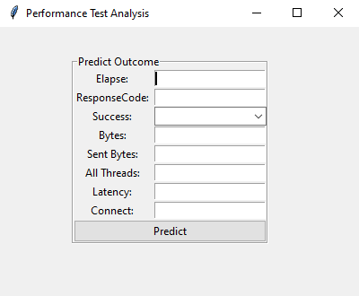

# PREDICCIÓN PERFORMANCE

Este aplicativo permite predecir si el resultado de una solicitud en las pruebas de rendimiento, cumple o no con los criterios de aceptación definidos para x proyecto.
Este aplicativo es el resultado de un trabajo de grado en el que se comparó entre diferentes modelos de entrenamiento cuál era el mas acertado a la hora de predecir el resultado de la prueba.




## Instalación de dependencias

Instalar todas las dependencias del proyecto usando el siguiente comando.

```bash
pip install -r requirements.txt
```

## Entrenamiento del modelo
Luego de instalar las dependencias, debemos ejecutar el entrenamiento del modelo en el cual se hace uso de los datos [data.xlsx](resources/data.xlsx)

```bash
python.exe trainModel.py
```
## Iniciar El Aplicativo
Ya con el entrenamiento del modelo, podemos iniciar la interface grafica para ingresar datos de forma manual que que se haga la predicción del resultado

```bash
python.exe trainModel.py
```

## Datos de prueba

```plain
| V0		      | V1 | V2 | V3          | V4          | V5 | V6          | V7          | V8 |
| 0,001752593 | 0  | 1  | 0,012814615 | 0,132629108 | 0  | 0,013104189 | 0,012502971 | 0  |
| 0,001994234 |	0  | 1  | 0,014260367 | 0,132629108 | 0  | 0,014541849 | 0,022533872 | 0  |
| 0,001319305 |	0  | 1  | 0           | 0,132629108 | 0  | 0,010526316 | 0,001426194 | 0  |
| 0,0017887   | 0  | 1  | 0,058224354 | 0,117370892 | 0  | 0,013302487 | 0,011029237 | 1  |
| 0,002116443 |	0  | 1  | 0,05829007  | 0,118544601 | 0  | 0,015268942 | 0,009507963 | 1  |
| 0,001377632 |	0  | 1  | 0,485509627 | 0,117957746 | 0  | 0,010873337 | 0,010458759 | 1  |
```

## Built With
* [Python 3.9.7](https://www.python.org/downloads/).

## Author

* **Cristian Seguro Gallego** - [cristian-seg](https://github.com/cristian-seg/PerformanceTestAnalysis)
